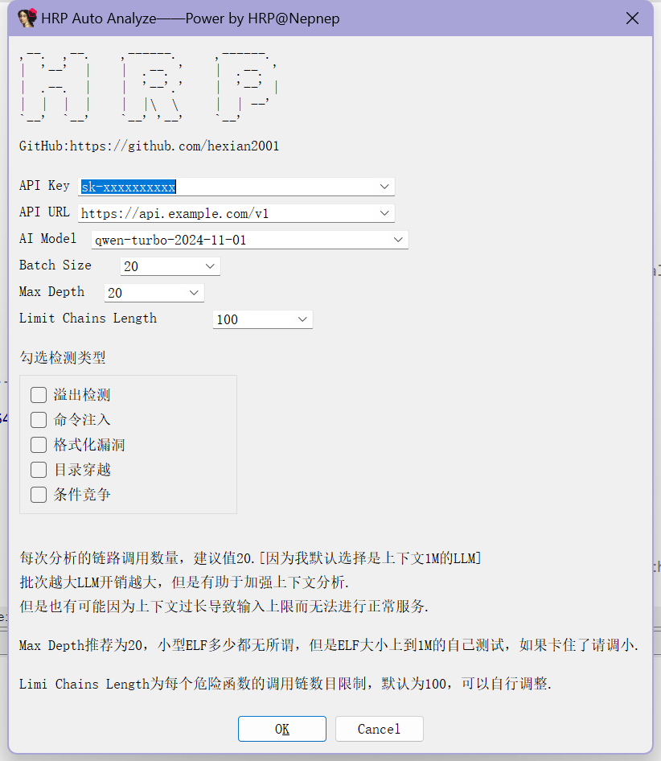
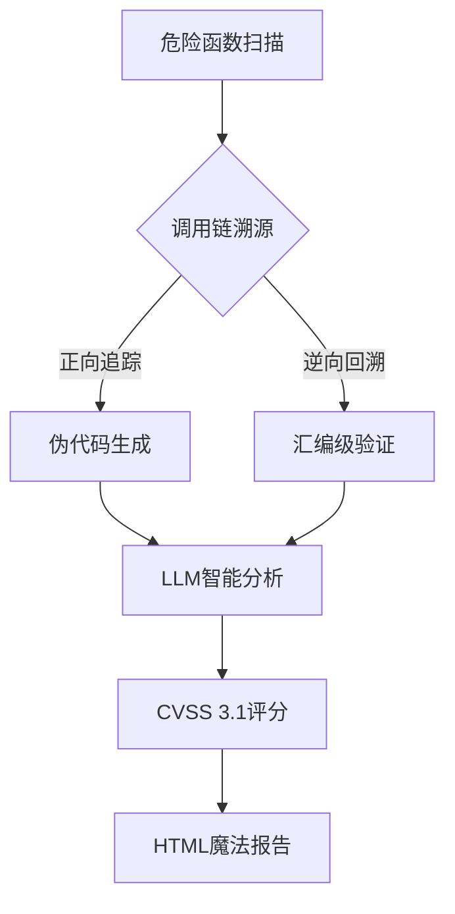

# 🚀 **HRP Auto Analyze 智能漏洞分析插件**  

🔥 *"让IOT分析像喝奶茶一样简单！"*  

---

<div align="center">
  
</div>


---

## 📚 **项目简介**  

**HRP Auto Analyze** 是一款基于IDA Pro的智能漏洞分析插件，专为二进制安全分析设计。它能够自动追踪危险函数的调用链，结合伪代码和汇编代码的双重视角，利用大语言模型（LLM）进行深度威胁建模，并生成炫酷的HTML报告。无论是IoT设备固件还是传统二进制文件，HRP都能帮助你快速发现潜在的安全漏洞。

---

## 🚀 **核心功能**  

### 1. **智能调用链追踪**  

- **危险函数检测**：自动识别`system()`、`strcpy()`等数十个高危函数。
- **调用链溯源**：从危险函数到输入源的完整路径追踪，支持正向和逆向分析。
- **路径可视化**：在HTML报告中以彩虹瀑布流的形式展示调用链。

### 2. **双重视觉呈现**  

- **伪代码分析**：利用Hex-Rays反编译器生成伪代码，便于理解程序逻辑。
- **汇编代码验证**：提供汇编代码的详细展示，确保分析的准确性。

### 3. **深度威胁建模**  

- **LLM智能分析**：集成DeepSeek/Qwen等大语言模型，进行CVSS评分和POC建议。
- **模型推荐:** **qwen-turbo-2024-11-01**, qwen2.5-14b-instruct-1m, deepseek-V3
- **风险等级评估**：根据CVSS评分自动划分漏洞风险等级（高危、中危、低危）。

### 4. **炫酷HTML报告**  

- **动态交互**：支持点击函数名查看伪代码和汇编代码，路径可折叠展开。
- **风险概况**：以卡片形式展示高危、中危、低危漏洞的数量和分布。
- **代码片段展示**：支持伪代码和汇编代码的左右分栏对比，方便深入分析。

### 5. **广泛的检测范围**  

- **危险函数矩阵**：覆盖`fgets`、`system`、`strcpy`、`memcpy`等数十个高危函数。
- **IoT设备支持**：特别针对IoT设备中常见的危险函数进行优化。

---

## 🛠️ **安装指南**  

```bash
# 找到你的IDA python 所在路径 例如 👇
C:\Python312\python.exe  -m pip install openai tenacity

# 然后打开你最喜欢的二进制文件，点击菜单开冲！
```

---

## 🎮 **使用说明书**  

1. 在IDA **ALT+F7**选择我 然后开始参数配置吧

   ```
   参数说明：
   1. API Key：推荐选择阿里云百炼平台或任何适配openai模块的平台都可选择
   2. API URL：平台给定的API链接地址
   3. AI Model：模型名称，根据官方提示获取
   4. Batch Size：每个危险函数，每批次可以处理的链路数量
   5. Max Depth：防止溯源深度发送深度爆炸情况
   6. Limit Chains Length：限制每个危险函数的总污染路径，避免路径爆炸
   7. 自行勾选检测类型：
   #危险函数总字典
   DANGER_CATEGORIES = {
       # 内存操作不当导致的缓冲区溢出或内存破坏
       "buffer_overflow": [
           "fgets",    # 缓冲区大小参数错误时溢出
           "gets",     # 无边界检查输入
           "read",     # 未校验读取长度
           "strncpy",  # 截断导致内容丢失或溢出
           "strcpy",   # 无长度检查的字符串复制
           "memcpy",   # 缺少边界检查的内存复制
           "strcat",   # 无长度控制的字符串拼接
           "sprintf",  # 格式化输出长度不可控
           "vsprintf", # 变参版本sprintf
           "snprintf", # 长度参数错误时仍可能溢出
           "recv",     # 网络数据长度未校验
           "recvfrom", # 同recv
           "strtok"    # 非线程安全的内存操作
       ],
       
       # 直接/间接执行系统命令
       "command_injection": [
           "system",   # 直接执行shell命令
           "popen",    # 管道方式执行命令
           "execl",    # 执行外部程序
           "dlopen"    # 加载动态库(可能执行初始化代码)
       ],
       
       # 用户可控的格式化字符串
       "format_string": [
           "sprintf",  # 格式化字符串输出
           "vsprintf", # 变参版本sprintf
           "printf",   # 直接输出格式化字符串
           "syslog",   # 系统日志接口
           "scanf",    # 格式化字符串输入
           "snprintf"  # 参数可控时仍存在风险
       ],
       
       # 路径处理不当导致越权访问
       "directory_traversal": [
           "dlopen",   # 加载非预期路径的动态库
           "chmod",    # 权限配置可能被路径利用
           "access",   # 存在目录穿越漏洞
       ],
       
       # 资源使用存在时间差漏洞
       "race_condition": [
           "access",   # 检查与使用之间的TOCTOU
           "vfork",    # 进程复制时的竞态窗口
           "strtok"    # 多线程使用时状态冲突
       ]
   }
   ```

   

2. 输入你的DeepSeek API密钥 **[强烈推荐阿里云百炼]**  

3. 收获一份比情人节礼物还精美的HTML报告 💌  

---

## 📊 **报告样例**  

  


---

## 🧠 **技术内幕**  




---

## 📜 **开源协议**  

**Apache2.0 License** 

---

> 💡 提示：本项目的危险函数检测准确率比猫咪找到纸箱的概率还高！  
> 🐞 问题反馈：在Issues区召唤开发者，开发者直接原地睡觉。  

---

<div align="center">
  
  <br>
  <b>让漏洞无处遁形，从HRP开始！</b>
</div>
